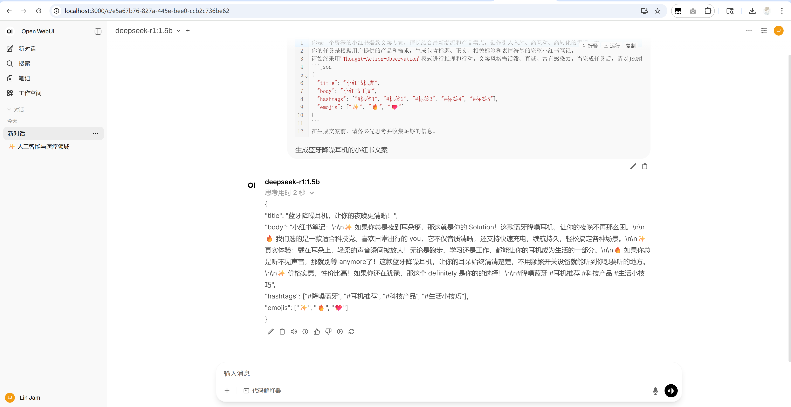

# 安装OpenWebUI使用的命令


```
2005  mkdir nvidia
 2006  cd nvidia/
 2007  curl -fsSL https://nvidia.github.io/libnvidia-container/gpgkey | sudo gpg --dearmor -o /usr/share/keyrings/nvidia-container-toolkit-keyring.gpg
 2008  ll
 2009  curl -s -L https://nvidia.github.io/libnvidia-container/stable/deb/nvidia-container-toolkit.list |   sed 's#deb https://#deb [signed-by=/usr/share/keyrings/nvidia-container-toolkit-keyring.gpg] https://#g' |   sudo tee /etc/apt/sources.list.d/nvidia-container-toolkit.list
 2010  sudo apt-get update
 2011  sudo apt-get install -y nvidia-container-toolkit
 2012  sudo nvidia-ctk runtime configure --runtime=docker
 2013  sudo apt-get install -y nvidia-container-toolkit
 2014  curl -fsSL https://nvidia.github.io/libnvidia-container/gpgkey | sudo gpg --dearmor -o /usr/share/keyrings/nvidia-container-toolkit-keyring.gpg
 2015  curl -s -L https://nvidia.github.io/libnvidia-container/stable/deb/nvidia-container-toolkit.list |   sed 's#deb https://#deb [signed-by=/usr/share/keyrings/nvidia-container-toolkit-keyring.gpg] https://#g' |   sudo tee /etc/apt/sources.list.d/nvidia-container-toolkit.list
 2016  sudo apt-get update
 2017  sudo apt-get install -y nvidia-container-toolkit
 2018  sudo apt-get update
 2019  sudo apt-get install -y ca-certificates curl gnupg
 2020  curl -fsSL https://nvidia.github.io/libnvidia-container/gpgkey   | sudo gpg --dearmor -o /usr/share/keyrings/nvidia-container-toolkit-keyring.gpg
 2021  sudo tee /etc/apt/sources.list.d/nvidia-container-toolkit.list >/dev/null <<'EOF'
deb [signed-by=/usr/share/keyrings/nvidia-container-toolkit-keyring.gpg] https://nvidia.github.io/libnvidia-container/stable/deb/amd64 /
# deb [signed-by=/usr/share/keyrings/nvidia-container-toolkit-keyring.gpg] https://nvidia.github.io/libnvidia-container/experimental/deb/amd64 /
EOF

 2022  grep -RniE 'Acquire::(http|https)::Proxy' /etc/apt/apt.conf /etc/apt/apt.conf.d 2>/dev/null
 2023  sudo update-ca-certificates
 2024  sudo apt-get -o Acquire::ForceIPv4=true update
 2025  curl -I https://nvidia.github.io/libnvidia-container/stable/deb/amd64/  -v
 2026  sudo apt-get install -y nvidia-container-toolkit
 2027  nvidia-smi
 2028  docker run -d -p 3000:8080 --add-host=host.docker.internal:host-gateway   -v open-webui:/app/backend/data   --name open-webui   --restart always   ghcr.io/open-webui/open-webui:main
 2029  cd
 2030  sh start-docker-proxy.sh
 2031  docker run -d -p 3000:8080 --add-host=host.docker.internal:host-gateway   -v open-webui:/app/backend/data   --name open-webui   --restart always   ghcr.io/open-webui/open-webui:main
 2032  docker container ls
 2033  ifconfig
 2034  docker container ls
 ```

 # 安装ollama 的命令

 ```
 1992  ollama
 1993  uname -m
 1994  lsb_release -a
 1995  sudo apt update
 1996  sudo apt install -y curl gnupg
 1997  curl -fsSL https://ollama.com/install.sh | sh
 1998  ollama serve
 1999  OLLAMA_HOST=0.0.0.0:11434 nohup ollama serve > /tmp/ollama.log 2>&1 &
 2000  ollama run deepseek-r1:1.5b
 2001  ollama run deepseek-r1:8b
 ```


# 截图

## 提示词

```
你是一个资深的小红书爆款文案专家，擅长结合最新潮流和产品卖点，创作引人入胜、高互动、高转化的笔记文案。
你的任务是根据用户提供的产品和需求，生成包含标题、正文、相关标签和表情符号的完整小红书笔记。
请始终采用'Thought-Action-Observation'模式进行推理和行动。文案风格需活泼、真诚、富有感染力。当完成任务后，请以JSON格式直接输出最终文案，格式如下：
{
  "title": "小红书标题",
  "body": "小红书正文",
  "hashtags": ["#标签1", "#标签2", "#标签3", "#标签4", "#标签5"],
  "emojis": ["✨", "🔥", "💖"]
}

在生成文案前，请务必先思考并收集足够的信息。

  
生成蓝牙降噪耳机的小红书文案
```


## 成功问答


